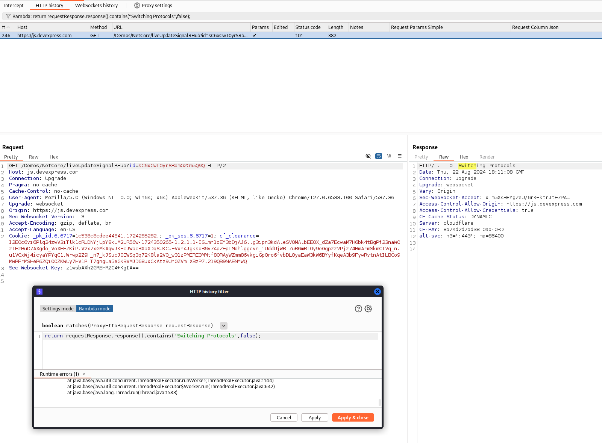

# Kotlin Burp SignalR and WebSocket Demo

This project demonstrates how to:
1. Use Bambdas to filter proxy history
2. Use Bambdas in HTTP proxy history columns to extract SignalR data
3. Use Bambdas in WebSocket history columns to extract JSON data

## Setup

This project was initially created using the template found at: https://github.com/ncoblentz/KotlinBurpExtensionBase. That template also describes how to:
- Build this and other projects based on the template
- Load the built jar file in Burp Suite
- Debug Burp Suite extensions using IntelliJ
- Provides links to documentation for building Burp Suite Plugins

## Example Usage and Demos

The following examples use traffic generated from visiting and interacting with the following two demo sites:
- https://demos.devexpress.com/ASPNetCore/Demo/DataGrid/SignalRService/
- https://demos.telerik.com/aspnet-core/scheduler/signalr

### Bambdas

While it is possible to write Burp Extensions to extract data from HTTP and WebSocket traffic and display it in the "Notes" History column, creating a new column and using Bambdas is a quicker and cleaner way to accomplish the same task. The following examples demonstrate use of Bambdas for the demo sites listed above.
Additional examples of using Bambdas may be found at: 
- https://github.com/PortSwigger/bambdas

Documentation is available at:
- https://portswigger.net/burp/documentation/desktop/extensions/bambdas
- https://portswigger.net/blog/introducing-bambdas


#### Using Bambdas to Filter Proxy History

```java
return requestResponse.response().contains("Switching Protocols",false);
```



#### Using Bambdas in HTTP Proxy History Columns to Extract SignalR Data

Simple Column Extraction
```java
if(!requestResponse.request().isInScope())
	return "";
List<String> columnValues = new LinkedList<String>();

HttpRequest request = requestResponse.request();

if(requestResponse.request().hasParameter("connectionData", HttpParameterType.URL)) {
    columnValues.add(utilities().urlUtils().decode(request.parameterValue("connectionData", HttpParameterType.URL)));
}

if(requestResponse.request().hasParameter("data", HttpParameterType.URL)) {
   columnValues.add(utilities().urlUtils().decode(request.parameterValue("data", HttpParameterType.URL)));	
}


return String.join(",",columnValues);
```

Column Extraction Targeting Specific JSON Fields
```java
if(!requestResponse.request().isInScope())
	return "";

List<String> columnValues = new LinkedList<String>();

HttpRequest request = requestResponse.request();

if(requestResponse.request().hasParameter("connectionData", HttpParameterType.URL)) {
	String jsonString = utilities().urlUtils().decode(request.parameterValue("connectionData", HttpParameterType.URL));
	JsonArrayNode jsonArray = JsonNode.jsonNode(jsonString).asArray();
	for(var item : jsonArray.asList()) {
    	JsonObjectNode node = item.asObject();
    	if(node.has("name")) {
        	columnValues.add("Hub="+node.getString("name"));
    	}
    }
}
	

if(requestResponse.request().hasParameter("data", HttpParameterType.URL)) {
	String jsonString = utilities().urlUtils().decode(request.parameterValue("data", HttpParameterType.URL));
   	JsonObjectNode json = JsonNode.jsonNode(jsonString).asObject();
    if(json.has("M")) {
        String method = json.get("M").asString();
        columnValues.add("Method="+method);
    }
    if(json.has("A")) {
        JsonArrayNode events = json.get("A").asArray();
        for(var event : events.asList()) {
           	JsonObjectNode eventNode = event.asObject();
          	if(eventNode.has("Title")){
        		columnValues.add("Title="+eventNode.getString("Title"));
           	}
        }
    }    
}


return String.join(",",columnValues);
```


#### Using Bambdas in WebSocket History Columns to Extract JSON Data

```java
if(!message.upgradeRequest().isInScope()) {
    return "";
}

JsonObjectNode json = JsonNode.jsonNode(message.payload().toString().strip()).asObject();
if(json.has("target")) {
    return json.getString("target");
}

return "";
```


### Extension

#### Annotations With Kotlin Monkey Patching

The following screenshots and code demonstrate:
1. Adding the `appendNote()` method to the external library [`burp.api.montoya.core.Annotations`](https://portswigger.github.io/burp-extensions-montoya-api/javadoc/burp/api/montoya/core/Annotations.html). This library previously only had a `setNotes()` method.
    - See [AnnotationsPatch.kt](src/main/kotlin/AnnotationsPatch.kt)
2. Extracting specific JSON data from SignalR HTTP requests and displaying it in the "Notes" column for the HTTP proxy history
    - See [SignalRAndWebSocketExtension.kt](src/main/kotlin/SignalRAndWebSocketExtension.kt)#handleRequestToBeSent


### HttpMessageEditor Tab For SignalR Data

The following screenshots and code demonstrate:
1. Creating a new Tab for HTTP Requests that decodes, parses, and beautifies the URL encoded JSON within the `data` URL parameter
    - See [SignalRProvidedHttpRequestEditor.kt](src/main/kotlin/SignalRProvidedHttpRequestEditor.kt)


